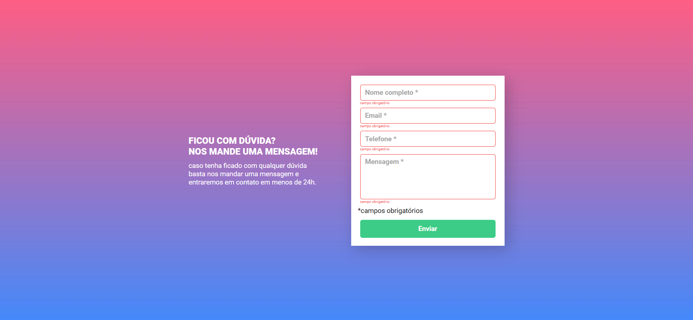
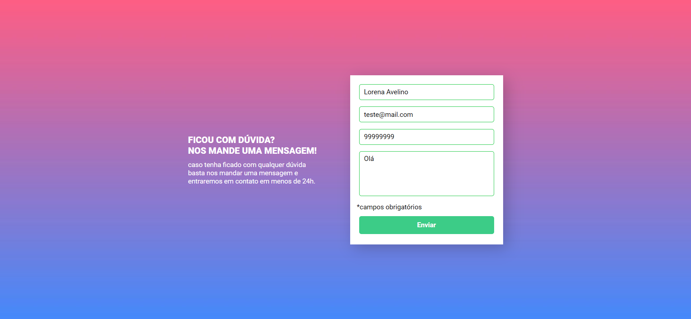

#  FORMULÁRIO COM VALIDAÇÃO

Essa aplicação é um Formulário, utilizando JavaScript puro para validação. O layout foi retirado do [Figma](https://www.figma.com/file/zBKnYG9UNdUiIr8ClQTWSG/?node-id=3%3A2).   

## Visão Geral 

 

Campo preenchido:  
- bordas ficam verdes.  

Campo vazio após clicar em enviar:
- bordas ficam vermelhas
- mensagem de _campo obrigatório_ abaixo do campo.   

###### _visualização do formulário sem preenchimento_

###### _visualização do formulário inválido_

###### _visualização do formulário válido_

 

[GitHub Pages](https://lorena-avelino.github.io/Formulario-com-validacao/)

## Tecnologias Utilizadas
 

